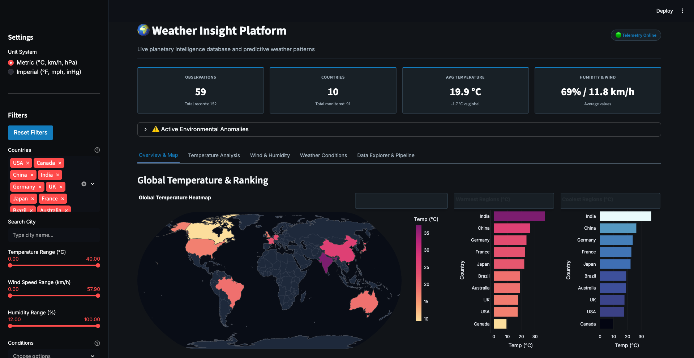
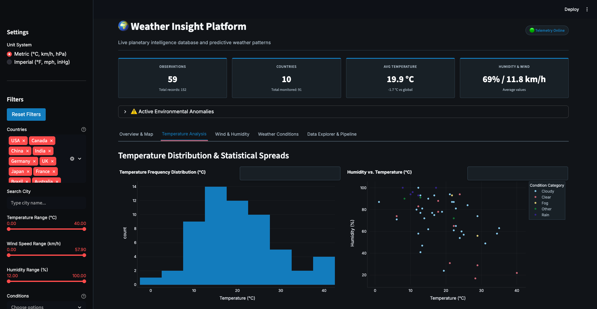
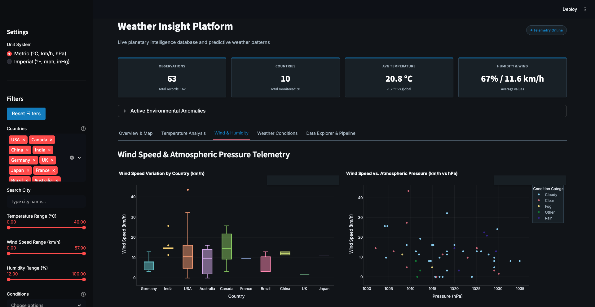
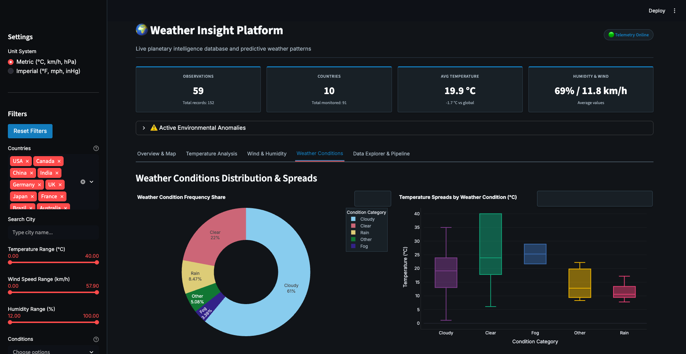
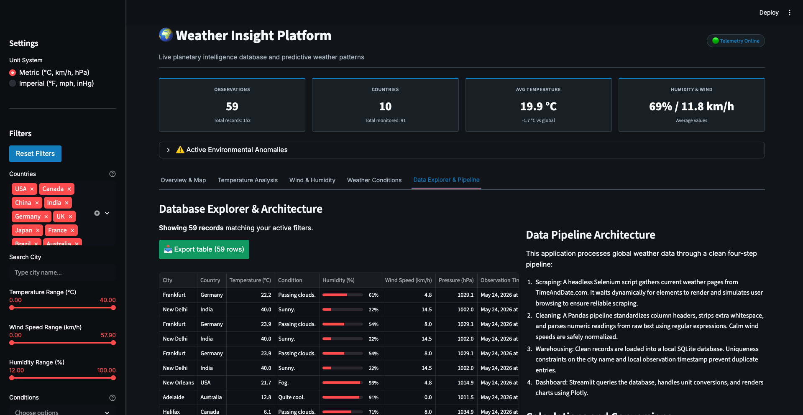

# Global Weather Insight Dashboard & Pipeline

This is a complete Python data project that scrapes live weather observations from the web, cleans the data using Pandas, stores it in a SQLite database, and displays it in an interactive dashboard.

It is designed to handle everything from raw, inconsistent HTML web tables to structured relational storage and visual analytics.

---

## Quick Start (3 Steps)

### 1. Set Up the Environment

Clone the repository, set up a virtual environment, and install the package in editable mode:

**On macOS/Linux:**

```bash
python3 -m venv .venv
source .venv/bin/activate
pip install -r requirements.txt
pip install -e .
```

**On Windows:**

```cmd
python -m venv .venv
.venv\Scripts\activate
pip install -r requirements.txt
pip install -e .
```

### 2. Run the Entire Project (Single Command)

You can run the scraper, cleaner, and database loader all at once using our orchestrator script:

```bash
python scripts/run_pipeline.py --limit 5
```

*(The `--limit 5` flag restricts scraping to 5 cities for testing. Remove this flag to run the scraper across the full list of global cities.)*

### 3. Launch the Dashboard

Open the interactive visual dashboard in your browser:

```bash
streamlit run app.py
```

---

## How It Works (The 4 Components)

Under the hood, the single `run_pipeline.py` script automatically runs three separate programs in order. You can also run these programs individually in your terminal if you want to test one step at a time:

1. **The Scraper (`scripts/scrape_weather.py`)**: Crawls live weather pages from TimeAndDate.com using Selenium headless Chrome.
   ```bash
   python scripts/scrape_weather.py --limit 5
   ```
2. **The Cleaner (`scripts/clean_weather.py`)**: Uses Pandas to standardize columns, parse numeric fields, handle empty entries, and convert units.
   ```bash
   python scripts/clean_weather.py
   ```
3. **The Database Loader (`scripts/load_database.py`)**: Loads the cleaned CSV records into SQLite, applying unique constraints to prevent duplicates.
   ```bash
   python scripts/load_database.py
   ```
4. **The CLI Query Tool (`query_weather.py`)**: Lets you query the database directly from your command line:
   ```bash
   python query_weather.py summary
   python query_weather.py extremes
   python query_weather.py countries
   python query_weather.py conditions
   python query_weather.py country "Japan"
   ```

---

## Core Details

### 1. Robust Selenium Scraper

* **Headless Runs**: Configures Chrome to run headlessly (`--headless=new`) to avoid spawning browser windows on your screen.
* **Ethics & Pacing**: Sets a realistic browser `User-Agent` and introduces random pauses to respect target host server bandwidth.
* **No Duplicate Work**: Extracts unique city URLs from the main weather table first. This prevents the scraper from visiting the same page twice.

### 2. Pandas Data Cleaning & Transformations

* **Regex Extraction**: Extracts numbers from raw text fields (e.g. extracting `25` from `25°C`, `65` from `65%`, or resolving calm wind speeds to `0.0`).
* **Conversion Math**:
  * *Temperature*: Converts Fahrenheit to Celsius when needed: $C = (F - 32) \times 5/9$
  * *Wind Speed*: Converts wind speed from mph to km/h ($1 \text{ mph} \approx 1.609 \text{ km/h}$).
  * *Pressure*: Converts pressure from inHg to hPa/mb ($1 \text{ inHg} \approx 33.864 \text{ hPa}$).
* **Path Resolving**: Uses regular expressions to extract sovereign countries from page URLs (e.g. resolving states or regional URLs back to standard names).
* **Summary Reports**: Writes a markdown summary to `reports/cleaning_summary.md` detailing row counts, duplicates removed, and raw vs. cleaned comparisons.

### 3. SQLite Database Layer

* **Composite Constraints**: Implements a composite primary key (`city`, `country`, `scraped_at`) to prevent duplicate entries if the loader script is run multiple times.
* **WAL Mode**: The database helper configures SQLite Write-Ahead Logging (`PRAGMA journal_mode=WAL;`) so that multiple dashboard panels can fetch data simultaneously without locking the database file.

### 4. Interactive Streamlit Dashboard

*  **Dark Styling**:Dark Blueprint UI standard, using custom CSS, Inter font families, and tabular-num spacing for tables.
* **Dynamic Visuals**: Renders a global choropleth map, wind/humidity scatters, and statistical boxplots that respond instantly to sidebar filters.

---

## Troubleshooting & Common Errors

Here are the fixes for common errors you might encounter:

* **`ModuleNotFoundError: No module named 'weather_capstone'`**
  * *Why*: Python does not know where to find the core package logic.
  * *Fix*: Ensure your virtual environment is active, and run `pip install -e .` from the root directory. This installs the project in editable mode.
* **`selenium.common.exceptions.WebDriverException` (Chrome binary not found)**
  * *Why*: Chrome isn't installed, or Selenium cannot find your browser.
  * *Fix*: Install the standard Google Chrome browser on your host machine. Selenium will detect it automatically.
* **`AttributeError: module '_plotly_utils.colors.sequential' has no attribute 'Ice'`**
  * *Why*: Plotly sequential attributes can vary between package versions.
  * *Fix*: Colors in `app.py` are declared as strings (e.g., `"ice"`, `"sunsetdark"`) rather than direct plotly module properties to ensure version compatibility.
* **`Command not found: python`**
  * *Why*: Your system may use `python3` instead of `python`.
  * *Fix*: Run `python3` instead of `python` inside your terminal, or double check that your virtual environment `.venv` is activated.

---

## Repository Structure

```text
weather-insight-dashboard/
├── data/
│   ├── raw/           # Scraped raw data CSVs
│   ├── processed/     # Cleaned CSV files
│   └── database/      # SQLite database
├── src/
│   └── weather_capstone/  # Core logic (scraper, cleaner, database helper)
├── scripts/           # Pipeline scripts
├── tests/             # Pytest unit tests
├── query_weather.py   # CLI query utility
├── app.py             # Streamlit dashboard
└── reports/           # Verification summaries & screenshots
```

---

## Dashboard Screenshots

#### 1. Overview Map & KPIs



#### 2. Temperature Spreads



#### 3. Atmospheric Scatters



#### 4. Weather Condition Frequency



#### 5. High Density Data Explorer



---

## Capstone Rubric Checklist

* [X] **Selenium Scraping**: Built in [scraper.py](src/weather_capstone/scraper.py) using headless Chrome, user-agents, explicit waits, and deduplication of target page links.
* [X] **Pandas Transformations**: Cleaned duplicates, normalized nulls, and converted units in [cleaner.py](src/weather_capstone/cleaner.py).
* [X] **SQLite Warehouse**: Creates table schemas and uses composite keys in [database.py](src/weather_capstone/database.py).
* [X] **Streamlit Visualizations**: Renders 5 responsive Plotly visualizations updated by dynamic sidebar filters in [app.py](app.py).
* [X] **Quality Control & Testing**: Verified using 42 passing unit tests (`pytest`).
